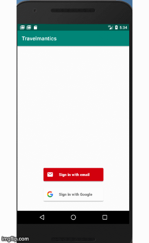
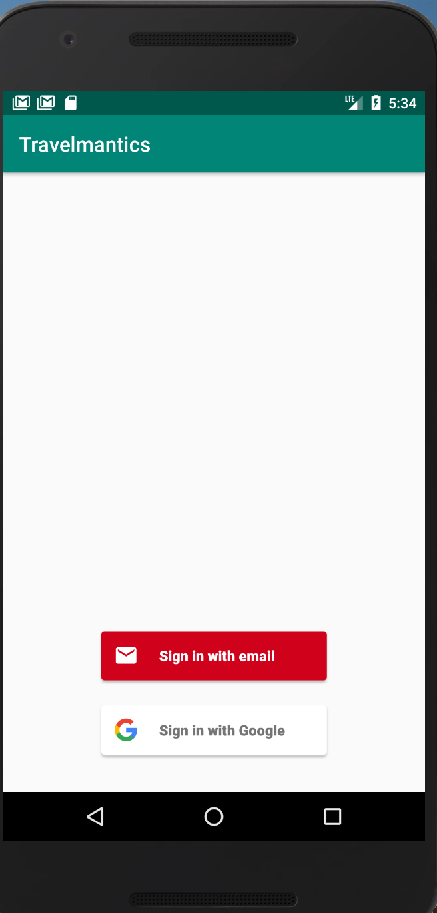
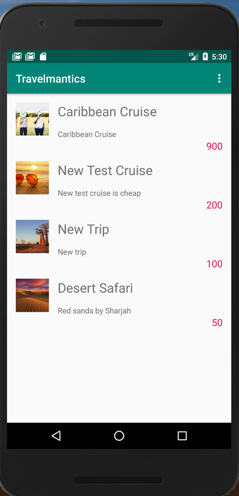
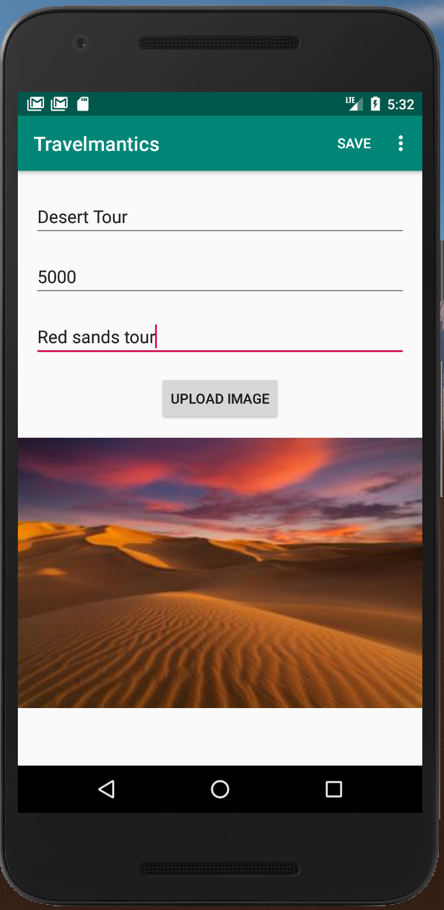
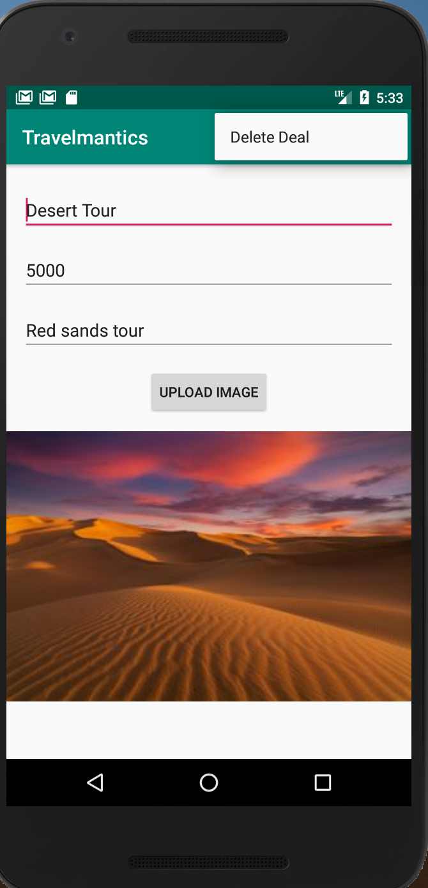

# Travelmantics
An app that uses Firebase real time database to create,read,update and delete travel deals.

## Features
- Firebase Authentication
- Firebase Realtime Database
- Firebase Realtime Storage

## Screenshots

1. Authentication
   -   
2. Travel Deals
   -  
3. Insert/Update Travel Deal
   -  
4. Delete Travel Deal
   - 

## License
[MIT License](./LICENSE.md)
